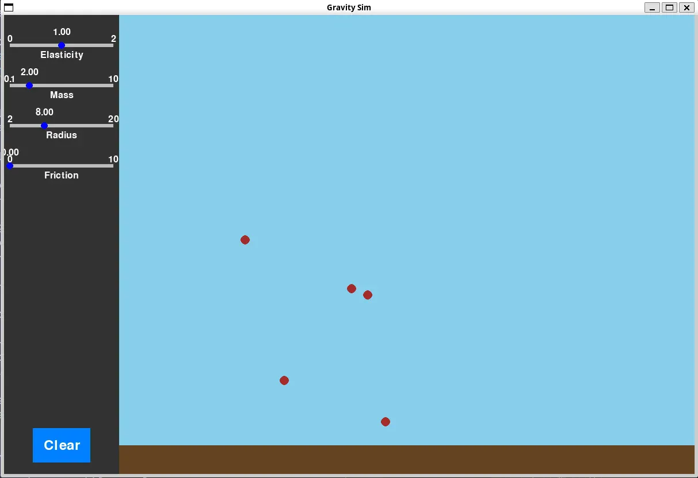

# Gravity Simulator

A 2D physics sandbox built with Pygame and Pymunk where you can spawn bouncing balls and experiment with physics properties in real-time.



## Features

- **Click to spawn**: Click anywhere in the main area to create balls
- **Adjustable physics**: Real-time sliders to control:
  - Elasticity (bounciness)
  - Mass
  - Radius (size)
  - Friction
- **Realistic physics**: Powered by Pymunk physics engine with collision detection and gravity simulation
- **Clear button**: Remove all balls and start fresh

## Installation
```bash
pip install pygame pymunk
```

## Usage
```bash
python main.py
```

Click in the main area to spawn balls. Adjust the sliders on the left panel to change the properties of new balls. Press "Clear" to remove all balls.

## Controls

- **Left Click**: Spawn a ball
- **Sliders**: Adjust physics properties for newly spawned balls
- **Clear Button**: Remove all balls from the simulation

## Requirements

- Python 3.x
- Pygame
- Pymunk
